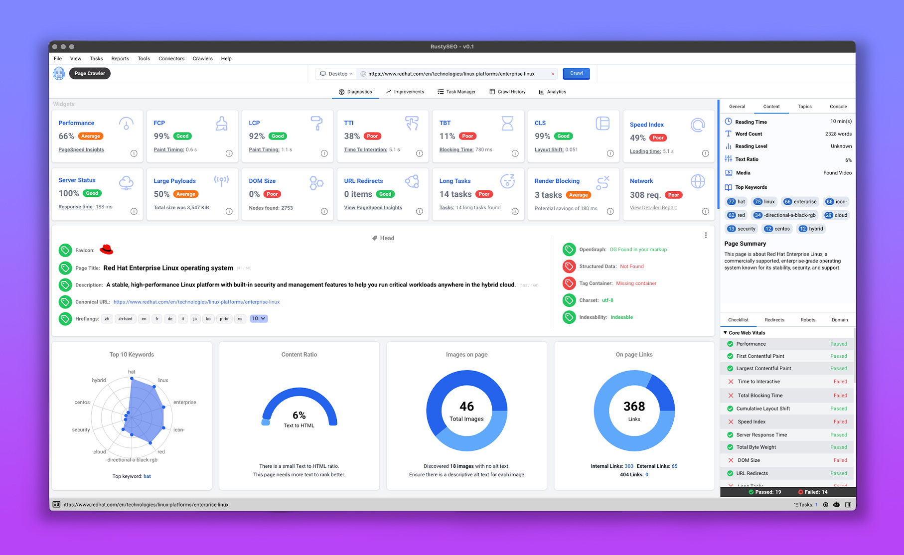
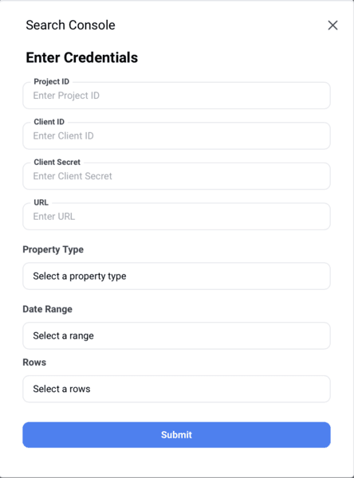
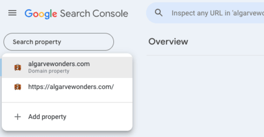

# RustySEO - A cross platform SEO toolkit

RustySEO is an all-in-one, cross-platform toolkit designed for comprehensive SEO analysis. It enables users to crawl websites and gain actionable insights into their marketing and SEO strategies.

As an open-source project, RustySEO aims to enhance your SEO efforts. Please note that initial versions may have bugs and issues, and we welcome your contributions in the form of bug reports or fixes via our repository.

Our mission is to offer a robust, free alternative to the costly commercial SEO tools currently on the market.

## TL;DR

We recommend you to use Google Gemini if you want the "Topics" feature.

As of today, the smaller local LLMs are not working properly and are not recommended if you want to use the "Topics" feature.

These LLMs might get deprecated in the future due to its lack of uniform performance across different models.

Authentication currently takes place server side, as such it is slightly more cumbersome when integrating with Google OAuth 2.0.

This authentication will be passed to the client side.

Use at your own risk, this software is new and under development.

Why join the Navy when you can be a SEO engineer?

## Features

- Shallow crawl (single page);
- Technical Diagnostics (core web vitals);
- SEO insights (content analysis, Keyword density, etc...);
- Improvements / Suggestions on page crawl;
- Dashboards;
- Task Manager / Tracker
- Reporting (CSV, Excel, Google Sheets, PDF);
- Topic generator;
- Keyword generator;
- Local LLM (ollama);
- Free API LLM (Google Gemini);
- Built in AI chatbot;
- Crawl history;
- Image conversion and optimization;

## Roadmap

- Deep crawl (multiple pages concurrently);
- More integrations;
- Better reporting;
- Password protection & encryption;

## Connectors / APIs (Get your keys, they are free 😉)
- [Google Search Console](https://search.google.com/search-console/about)
- [Google Cloud Platform](https://console.cloud.google.com/welcome)
- [GA4](https://analytics.google.com/analytics/web/)
- [Google Gemini](https://ai.google.dev/gemini-api/docs/api-key)
- [Ollama](https://ollama.ai/)
- [PageSpeed Insights](https://developers.google.com/speed/docs/insights/v5/reference/pagespeedapi/runpagespeed)
- [Microsoft Clarity](https://clarity.microsoft.com/)

# Setting up Google Search Console

- [Windows](#windows)
- [Mac OS](#usage)
- [Linux](#screenshots)

## Windows

To setup Google Search Console, follow these steps:

1. You need to set up [Google Cloud Console](https://console.cloud.google.com/) with Search Console API enabled and Service Account active. Make sure you have full ownership of your GSC property. 

2. Launch RustySEO;

3. Go to the menu **Connectors** 👉 **Search Console**

4. Add your Google Search Console credentials



You can find all the details in your Google Cloud console account with the exception of the "URL" and "Propery Type", which should match what you have in your Google Search console account.



5. Submit the credentials and your desired options

6. Quit RustySEO

7. Make sure you have  installed. Open your Windows Powershell and run the following command:

```bash
wsl --set-version ubuntu
```


6. **Connect s**:

   ```bash
   npm install
   ```

4. **Run the software**:

   ```bash
   npm start
   ```

## Mac OSX

After installation, you can start using My Software. Here are some basic instructions:

1. **Open the application**:

   Open your browser and go to `http://localhost:3000`.

2. **Login**:

   

   Enter your username and password, then click "Login."

3. **Navigate the Dashboard**:

   

   Use the menu on the left to navigate through different sections of the application.

4. **Perform a Task**:

   

   Follow the instructions on the screen to complete your task.

## Linux

Here are some screenshots of the application:

- **Login Screen**:

  

- **Dashboard**:

  

- **Task Screen**:

  

## Troubleshooting

If you encounter any issues, check the following:

- **Ensure dependencies are installed**: Run `npm install` again to make sure all dependencies are correctly installed.
- **Check for errors**: Review the terminal output for any error messages.
- **Consult the documentation**: Check the [docs](./docs) for more detailed information.

If you need further assistance, feel free to open an issue on GitHub or contact support.

## Contributing

We welcome contributions! If you'd like to contribute to My Software, please follow these guidelines:

1. Fork the repository.
2. Create a new branch (`git checkout -b feature/your-feature`).
3. Commit your changes (`git commit -am 'Add new feature'`).
4. Push to the branch (`git push origin feature/your-feature`).
5. Create a new Pull Request.

## License

This project is licensed under the MIT License - see the [LICENSE](./LICENSE) file for details.
